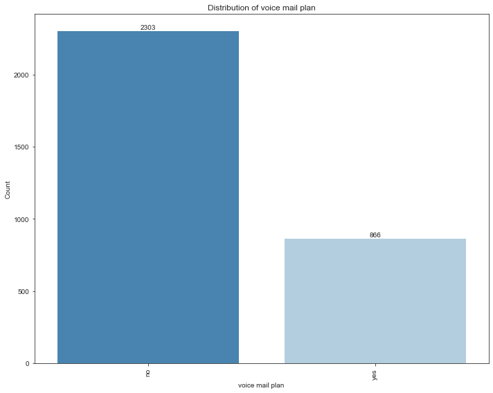
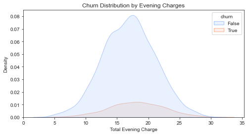
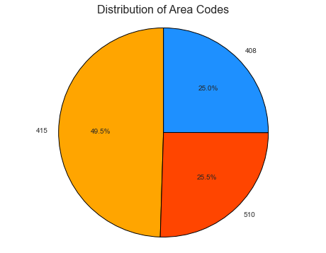

# SyriaTel-Customer-Churn-Prediction
### By : Angela Wanjiru maina

## Overview
This repository provides all the necessary code, data, and documentation for developing a predictive model aimed at addressing SyriaTel’s high customer churn rate. The primary goal of this project is to identify customers at risk of leaving, analyze the key factors contributing to churn, and offer actionable recommendations to boost customer retention. Using a comprehensive dataset obtained from Kaggle, the repository covers everything from data cleaning and preparation to model development, performance evaluation, and strategic insights. The end objective is to build a reliable predictive model with strong accuracy and recall, helping SyriaTel reduce churn and drive profitability. Browse through the repository to discover detailed walkthroughs, notebooks, presentations, and results that cover the entire process, from initial data exploration to model deployment.

## 1. Business Understading

### Problem Overview

SyriaTel, a telecommunications company, is experiencing a significant customer churn problem, with many clients opting to leave and switch to competitors. To tackle this challenge, SyriaTel seeks to create a predictive model to anticipate customer churn. By doing so, the company hopes to better understand the key factors driving customer departures, improve retention rates, and ultimately boost profitability.

### Goals

1.Identify the primary factors leading to customer churn.

2.Build a model to predict which customers are most likely to leave.

3.Offer recommendations to proactively retain customers and reduce churn.

### Success Criteria

1.A reliable customer churn prediction model with high accuracy and a recall score of at least 0.75.

2.Identification of critical features that contribute to customer churn.

3.Practical recommendations for SyriaTel to lower churn rates and enhance customer loyalty.

## 2. Data Understanding
The dataset for this project is sourced from Kaggle (https://www.kaggle.com/datasets/becksddf/churn-in-telecoms-dataset) and was obtained directly from their repository.

This dataset is a single, comprehensive collection of data relevant to customer churn analysis. It includes various features that provide insights into customer behavior and interactions with the service provider. Its value lies in its thorough coverage of factors like service usage, billing details, and customer support engagements—all of which are critical for predicting churn.

By analyzing these features, we can develop models to identify customers at risk of leaving, allowing the company to take early action to retain them.

#### Categorical Features:

`state`: The state where the customer resides.

`phone number`: The phone number of the customer.

`international plan`: Whether the customer has an international plan (Yes or No).

`voice mail plan`: Whether the customer has a voice mail plan (Yes or No).

#### Numeric Features:

`area code`: The area code associated with the customer's phone number.

`account length`: The number of days the customer has been an account holder.

`number vmail messages`: The number of voice mail messages received by the customer.

`total day minutes`: The total number of minutes the customer used during the day.

`total day calls`: The total number of calls made by the customer during the day.

`total day charge`: The total charges incurred by the customer for daytime usage.

`total eve minutes`: The total number of minutes the customer used during the evening.

`total eve calls`: The total number of calls made by the customer during the evening.

`total eve charge`: The total charges incurred by the customer for evening usage.

`total night minutes`: The total number of minutes the customer used during the night.

`total night calls`: The total number of calls made by the customer during the night.

`total night charge`: The total charges incurred by the customer for nighttime usage.

`total intl minutes`: The total number of international minutes used by the customer.

`total intl calls`: The total number of international calls made by the customer.

`total intl charge`: The total charges incurred by the customer for international usage.

`customer service calls`: The number of customer service calls made by the customer.

### 2. Data Preparation

In this section, we undertake several important steps to prepare the dataset for building predictive models. This process includes-:

a) Data Cleaning, where we address any missing values, handle outliers, and check for duplicates to improve the overall quality of the dataset. 
 
 b) Data Exploration, where we perform exploratory data analysis (EDA) to uncover patterns, correlations, and insights within the data, helping us to better understand the relationships between different variables. 
 
c) Feature Engineering, where we create new features or transform existing ones, optimizing them to improve the performance of our predictive models. 

These steps are crucial in ensuring the data is well-prepared for accurate and reliable modeling."

#### 2.1 Data Cleaning, 
Addressing any missing values, handle outliers, and check for duplicates to improve the overall quality of the dataset. 

##### 2.1.1 Missing values
 no missing values, 

##### 2.1.2 Duplicate rows
There were no duplicates

##### 2.1.3 Handling outliers
It is evident that many features contain outliers, which can introduce disturbance into the data. To enhance the model's predictive accuracy, we will address this issue by removing data points that fall beyond three standard deviations, thereby reducing the impact of these extreme values.

After removing outliers, the number of rows in the dataset has now been reduced to 3169 

From the business understanding, the area code represents a categorical value rather than a numerical one, despite being stored as an integer. Therefore, we need to convert the area code column to a categorical data type by changing it to an object."

##### 2.1.4 Dropping column phone number for it is irrelevant to our analysis:
After data cleaning, print the number of rows and columns  being used to conduct analysis
The number of rows: 3169
The number of columns: 20

#### 2.2 Explanatory Data Analysis (EDA)
Performing exploratory data analysis (EDA) to uncover patterns, correlations, and insights within the data, helping us to better understand the relationships between different variables.

##### 2.2.1 Churn distribution
The churn variable indicates whether a customer has churned or not, with two possible outcomes: 'True' for customers who have churned and 'False' for those who have not.

Among the 3169 customers, 442 have churned, meaning they have cancelled their contracts with the company, while 2727 have remained. This distribution highlights a noticeable class imbalance, which needs to be addressed before modelling, as it could lead to skewed or inaccurate predictions.

##### 2.2.2 Numerical Features Distribution

The majority of the features are normally distributed, especially usage-related ones (minutes, calls, charges), which suggests uniform customer behavior in these aspects.
Features like "number of voicemail messages," "total intl calls," and "customer service calls" show skewed distributions, indicating that only a minority of customers engage in these activities frequently.

##### 2.2.3 Cartegorical Features Distribution

From the distibution the top 5 areas that have the most customers are : West Virginia WV, Minnesota MN, New York NY, Ohio OH and AL Atlanta.

Out of 3169 customers, 309 have an international plan

Out of 3169 customers, 866 have a voice mail plan

##### 2.2.4 Distribution of Categorical Features by churn rate

The top 5 states with the highest churn (Orange bars) are: 
WV (West Virginia), NJ (New Jersey), CA (California), TX (Texas) & OH (Ohio)

The area code where the most churned customers is area code 415.

The majority of customers who churned did not subscribe to an international plan, indicating that a lack of this service might be a factor in their decision to leave. On the other hand, customers who retained their accounts also had a relatively low subscription rate to the international plans, but it was still noticeably higher compared to those who churned. This suggests that while international plans might not be the most popular service, having it might contribute to customer retention to some extent.

The majority of customers who churned did not subscribe to a voicemail plan, indicating that a lack of this service might be a factor in their decision to leave. On the other hand, customers who retained their accounts also had a relatively low subscription rate to voicemail plans, but it was still noticeably higher compared to those who churned. This suggests that while voicemail plans might not be the most popular service, having it might contribute to customer retention to some extent.

##### 2.2.5 Distribution of Churn by Day, Evening & International charges
The charts will  illustrate the distribution of churn based on total day charges, Evening Charges and International Charges with two density curves representing customers who churned (True) and those who did not churn (False).

i) Churn by day charges

The distribution suggests that customers with higher day charges are somewhat more likely to churn, although the overall churn rate is low relative to the number of customers who stay.

ii) Churn by Evening charges

The distribution suggests that customers with higher evening charges are somewhat more likely to churn, although the overall churn rate is low relative to the number of customers who stay.

iii) Churn by Night Charges

The distribution suggests that customers with higher night charges are somewhat more likely to churn, although the overall churn rate is low relative to the number of customers who stay.

iv) Churn by international Charges

The distribution suggests that customers with higher international charges are somewhat more likely to churn, although the overall churn rate is low relative to the number of customers who stay.

##### 2.2.6 Area Code Distribution
Since area code has 3 distributions " 415, 408, 510", this can be represented in a pie chart to show the distribution

The pie chart shows the distribution of area codes among customers, with three distinct segments:

Area Code 415 represents the largest segment at 49.5% of the total, indicating that this area has the highest concentration of customers. This area is likely to have the highest churn rate.

Area Code 510 constitutes 25.5% of the total, which is the second-largest segment, suggesting a moderate customer base and potentially a significant churn rate.

Area Code 408 makes up 25.0% of the total, representing the smallest segment, with a potentially lower churn rate compared to the other areas.

The largest segment, Area Code 415, is of particular concern as it likely has the highest churn rate, making it a critical focus for targeted retention strategies.

##### 2.2.7 Correlation Analysis

From the correlation heatmap, the variable churn has the highest correlation with total day minutes and total day charge (0.22), indicating that customers who spend more time on calls during the day are slightly more likely to churn.
customer service calls also shows some positive correlation with churn (0.17), implying that customers who call customer service more frequently are more likely to churn.
Many of the features have weak or negligible correlation with churn, such as account length, total intl minutes, and number vmail messages, with correlation coefficients close to 0. This indicates that these features do not significantly contribute to predicting churn.
Total day charge and total day minutes, Total eve charge and total eve minutes , Total night charge and total night minutes, Total int charge and total int minutes are highly correlated and might introduce redundancy in a model, so feature selection technique is considered.

i) Feature Selection
The goal is to drop highly correlated features that are > than 0.90. This is so as to prevent redundancy in the model

#### 2.3 Feature Engineering
Feature Engineering involves encoding cartegorical variables and scaling the data.

##### 2.3.1 Encoding
To begin, we apply label encoding to convert binary categorical columns with "yes" or "no" responses into numerical values. Specifically, the churn column is transformed to a binary format where "yes" is encoded as 1 and "no" as 0

Next, we use one-hot encoding to convert categorical variables into multiple binary features. For each category, a new binary column is created. This technique is applied to columns such as 'state', 'area code', 'international plan', and 'voice mail plan'

By doing this, we transform our categorical features into a format that can be readily used by machine learning algorithms. The dataset now contains a set of binary features representing each category.

##### 2.3.2 Scaling
To ensure that the numerical features are on the same scale and to reduce the influence of outliers, we will apply Min-Max Normalization. This scaling technique will transform the values to a fixed range, typically between 0 and 1.

This ensures that each numerical column in the DataFrame is normalized. The result will allow the model to better interpret the data, minimizing any disproportionate influence from features with larger ranges.

### 3.Modelling 
We are now going to implement a variety of machine learning models to predict customer churn based on selected features. Our primary evaluation metric will be the recall score. A recall score of 0.75 or higher will signify that the model is highly effective in identifying churners.

We will begin with a baseline model using Logistic Regression and compare its performance against other algorithms, including Decision Tree, Random Forest, and XGBoost. The goal is to determine which model performs best in terms of recall. To further assess model performance, we will also utilize the ROC-AUC (Receiver Operating Characteristic - Area Under the Curve) metric. This comprehensive approach will allow us to select the most reliable model for churn prediction.

#### 3.1 Train-Test split
We begin by splitting the dataset into training and testing sets. We allocate 80% of the data for training and 20% for testing

#### 3.2 Balancing Churn Classes with SMOTE
To address class imbalance, we apply the SMOTE (Synthetic Minority Over-sampling Technique) algorithm. This technique generates synthetic examples to augment the minority class, improving the class distribution balance

By oversampling the minority class, we ensure the model receives a more balanced dataset for training.

#### 3.3 Logistic Regression
Logistic Regression is a widely-used binary classification algorithm that estimates the probability that a given instance belongs to a specific class. This model works by applying a logistic function (also known as the sigmoid function) to a linear combination of the input features, producing a value between 0 and 1, which can be interpreted as the probability of the instance being in the positive class. We will use Logistic Regression as our baseline model to assess how well we can predict the target class based on the available features

The model demonstrates a high number of true positives and true negatives relative to false positives and false negatives. This indicates that the model is generally accurate in its predictions, successfully identifying the correct class in most cases. Additionally, the balanced performance suggests that the model is not overfitting, as it maintains accuracy across both classes.

The recall score is 0.67  which is below the target recall score of 0.75. This means the model the model is not well-suited for predicting churn as desired.  However we still want to plot other models and figure out which has a higher recall score, thus considered the best model to predict churn.

The model shows that the top features for churn prediction are total day charge and customer service calls

#### 3.4 Decision trees
 A Decision Tree is a versatile and intuitive supervised machine learning algorithm that excels in classification tasks. It works by recursively splitting the dataset into subsets based on the most significant features, forming a tree-like structure. Each internal node represents a decision based on a feature, while each leaf node represents a class label or outcome. Decision Trees are particularly valued for their ability to handle both numerical and categorical data, as well as their interpretability, making them a powerful tool for understanding complex decision-making processes in classification tasks.

 
 Similar to the logistic regression model, the decision tree model correctly identifies more true instances than false ones. This suggests that the model is capable of making accurate predictions, effectively distinguishing between the different classes.

The model has achieved a recall score of 0.68. This is lower than the target recall score of 0.75. This means the model is not well-suited for predicting churn as desired.  However we still want to plot other models and figure out which has a higher recall score, thus considered the best model to predict churn.

The model shows that the top features for churn prediction are customer service calls, total day charge and international plan_yes 

#### 3.5 Random Forest
A Random Forest is an ensemble method that combines multiple decision trees to make a prediction. It works by training many decision trees on random subsets of the data and features. The final prediction is made by averaging the predictions of all the individual trees (for regression) or by taking the majority vote (for classification).

Similar to the logistic regression model and Decision tree model the Random Forest model correctly identifies more true instances than false ones. This suggests that the model is capable of making accurate predictions, effectively distinguishing between the different classes.

The model has achieved a recall score of 0.73. This is below the target recall score of 0.75. With this score, it proves that the model is better than the Decision Tree Model (Recall score = 0.68) and Logistic regression ( Regression Score = 0.67). However its best to look for a better model with a higher recall score than the target recall score.

The model shows that the top features for churn prediction are total day charge and customer service calls

#### 3.6 XG Boost
XGBoost is an advanced implementation of the Gradient Boosting algorithm, which builds trees sequentially. Each new tree is trained to correct the errors made by the previous trees. XGBoost focuses on optimizing both the speed and performance of the model, and it includes regularization techniques to prevent overfitting.

Similar to the logistic regression model,Decision tree model and Random Forest model, the XG Boost Model correctly identifies more true instances than false ones. This suggests that the model is capable of making accurate predictions, effectively distinguishing between the different classes.

The recall score is about 0.79. This is higher than the target recall score of 0.75. This makes it the best model to be used for the churn prediction. This is the best model overall.

The model shows that the top features for churn prediction are International plan_no, voice mail plan_no and customer service calls

### 4. Model Evaluation
In this section, we assess the performance of our models by comparing their recall scores, which are crucial for identifying customers likely to churn. High recall ensures that the model accurately captures the majority of churned customers, minimizing false negatives. In addition to recall, we evaluate each model's performance using the ROC (Receiver Operating Characteristic) curve, which provides insight into the trade-off between true positive rates and false positive rates across various threshold settings. By analyzing both the recall scores and the area under the ROC curve (AUC), we aim to select the model that strikes the best balance between sensitivity and overall predictive accuracy.

#### 4.1 Recall Scores
Based on the recall scores for each model, XGBoost achieved the highest recall score of 0.7857, outperforming the other models—Random Forest (0.7347), Decision Tree (0.7041), and Logistic Regression (0.6735). This indicates that XGBoost is the best model for identifying customers at risk of churn, as it correctly predicts the largest proportion of actual churn cases. The higher recall score suggests that XGBoost is more effective at capturing the true positive churns compared to the other models, making it the most suitable choice for addressing customer churn in this case.

#### 4.2 ROC Curves

Logistic Regression (AUC = 0.766):
The blue curve represents the Logistic Regression model.
The AUC (Area Under the Curve) score of 0.766 indicates a moderate ability of this model to distinguish between churn and non-churn customers.
The curve is closer to the diagonal line compared to other models, showing that its predictive performance is lower than the other classifiers.

Random Forest (AUC = 0.899):
The orange curve represents the Random Forest model.
With an AUC score of 0.899, Random Forest performs quite well. It demonstrates a strong ability to distinguish between churn and non-churn classes.
The curve shows that Random Forest minimizes false positives while maintaining a high true positive rate across various thresholds, making it one of the top-performing models in this comparison.

Decision Tree (AUC = 0.807):
The green curve represents the Decision Tree model.
An AUC score of 0.807 suggests that the Decision Tree model also performs fairly well, though not as effectively as Random Forest or XGBoost.
The curve has steeper angles indicating that its performance can vary significantly depending on the decision thresholds.

XGBoost (AUC = 0.885):
The red curve represents the XGBoost model.
With an AUC score of 0.885, XGBoost also shows strong performance, almost comparable to Random Forest.
Its curve closely follows the top-left corner, which indicates that it strikes a good balance between true positive rate and false positive rate.

Given the goal is to maximize predictive performance, Random Forest and XGBoost would be the preferred models for predicting churn, as they provide the best balance between true positive rate and false positive rate. However, further model fine-tuning could improve their performance even more.

### 5. Conclusion & Final thoughts
XGBoost had the highest recall score (0.786), which indicates that it successfully identifies more churners compared to other models.
However, Random Forest showed the highest AUC (0.899) on the ROC curve, meaning it generally performs better in balancing true positives and false positives, which makes it a strong overall model.

Since the problem overview of SyriaTel seeks to create a predictive model to anticipate customer churn, XGBoost would be the best choice. It is better at catching potential churners even if it might come at the cost of a higher number of false positives.

### 6. Recommendations
1. Pricing Strategy Review:

Reassess pricing structures across various time periods (daytime, evening, and night) as well as international charges. Offering discounted pricing plans during peak times or for international calls may help retain customers who are currently considering switching due to cost concerns.

2. Area code Targeted Discounts and Promotions:

Focus on area code 415 , where the churn rate is notably high. Providing personalized discounts or promotions for customers in these regions could incentivize them to remain loyal to the company.

3. Improved marketing strategies

To address high churn rates in states like WV (West Virginia), NJ (New Jersey), CA (California), TX (Texas) & OH (Ohio) , it's essential to implement targeted campaigns focused on customer retention. Enhancing marketing strategies in these regions can include personalized offers, loyalty programs, and proactive customer support. By understanding the specific needs and pain points of customers in these states, you can create more effective engagement initiatives that strengthen customer relationships and reduce churn.